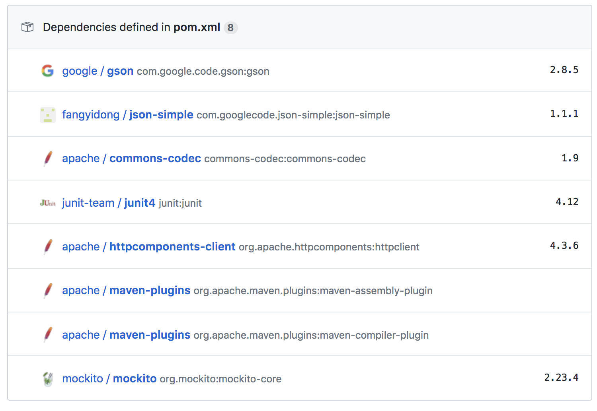

# API Exam - Github and Twitter API Mashup

## Description

The following repository contains a project to API interactions with **Java**. The APIs in questions are supplied by [Twitter](api.twitter.com) and [Github](api.github.com).

The project runs an API request to Github, looking for any repositories which are labelled with _"Reactive"_.
The API call is handled by [Apache HTTPClient](https://hc.apache.org/httpcomponents-client-ga/).

The results are processed to extract summary data about each project.
Of the resulting repositories **ten** are selected to proceed to the next stage, calling the Twitter API.

Prior to calling the Twitter API, the Consumer Key and Consumer Secret (supplied by [Twitter](https://developer.twitter/com)) are combined into a **Base64 String** to form a _BearerToken_ for authentication.
The Consumer Key and Secret and not stored with the project as found in GitHub, but are stored locally only in a configuration file.

The relative path for said credentials file is: _secrets/credentials.csv_

Once the program has a valid Bearer token, it proceeds to call the Twitter API.

For each of the ten projects, the program constructs a query URI and supplies it to the TwitterApiCaller object, along with the Bearer token.
Twitter responds with a collection of Tweets about the project in question (if any exist).
And [GSON](https://github.com/google/gson) translates this __.json__ output to create __Tweet__ and __User__ objects.

Finally, the project displays the information it has gathered one project at a time. In the format:

- Project Name.
- Project Summary.
- Project URL.
- Tweets about project. (Displayed as _.JSON_ format objects).

## Build Instructions

The following is a summary of the building, running and dependencies of this project.

### Build Structure

This project is written in Java 8 (for the 1.8 SDK).
The project builds an executable JAR file (located within the _Target_ directory) using [Maven by Apache](https://maven.apache.org/).
Since it is a Maven project, all the dependencies can be found within the __*dependencies*__ section of the _pom.xml_ file on the root of the project.

### Running Instructions - IDE

This project should package all of its dependencies to any IDE configured for Java and Maven.
It has been tested in both *Eclipse* and *IntelliJ* for compatibility.
There is one main method for this project, located here:

__Main:__ _src/main/java/com/nialljude/dev/app/Main.java_

The modular thread of execution (detailed in the __Description__ above) can be followed from within the __Main__ method.

### Running Instructions - Command Line

In order to run this project from Command Line, you will need the following:

- As mentioned above, you will need to create a Twitter Develop App as a pre-requisite to this project.
You will need to obtain a __Consumer Key__ and __Consumer Secret__ to authenticate against the Twitter API.
Instructions can be found [here](https://developer.twitter.com/en/docs/basics/authentication/guides/access-tokens).

- When you have obtained the credentials, they must be stored in _secrets/credentials.csv_ in the format '\<consumerkey>,\<consumersecret>' and saved.
If you wish to update the credentials file path, the relevant code is located here: _'com.nialljude.dev.credentials.CredentialManager'_

- A JAR file of the project which can be obtained by running a '_mvn package_' command from the root of the project.
This will place an executable JAR in the root of the project. An IDE like _IntelliJ_ and _Eclipse_ can also build JAR files.

- Once the JAR has been obtained. You will need to ensure your terminal / command line is configured to run Java.
Instructions for Windows can be found [here](https://introcs.cs.princeton.edu/java/15inout/windows-cmd.html).

- Finally, with all the above steps completed, you can run the JAR file with the command below.

__Command Line:__ java -jar \<path-to-jar>

Following this, the program should run without further interaction and output directly to the command line.

### Dependencies

The following image summarises the dependencies.

